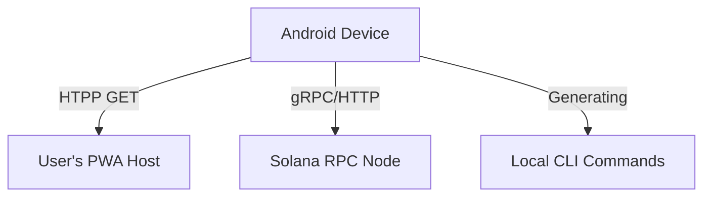

# Bubble Wrapper App Architecture & Backend Guide

This document outlines the architecture of the **Bubble Wrapper** Android application (`bubble-wrapper-app`) and explains its backend requirements.

## 🏗️ Architecture Overview

The Bubble Wrapper app is designed as a **standalone, client-side utility**. It does **not** require you to deploy a custom backend server (middleware) to function.

The app operates entirely on the user's Android device, interacting directly with public infrastructure and the user's own PWA hosting.

### Data Flow

---

## 🔌 Backend Requirements

**Verdict:** NO custom backend is required to run this app.

You do **not** need to set up a Node.js server, Python backend, or database for the Bubble Wrapper app itself using its current feature set.

### Why?
1.  **Command Generation:** The core feature (generating `bubblewrap` and `dapp-store` commands) is performed locally using string templating in Kotlin.
2.  **Manifest Parsing:** When implemented, manifest fetching is a direct HTTP request from the Android device to the PWA URL.
3.  **Publishing:** The app generates commands for the `@solana-mobile/dapp-store-cli`. The actual "backend" for publishing is the Solana Blockchain itself.

---

## 🌍 External Infrastructure Dependencies

While the app doesn't need *its own* backend, it relies on the following external infrastructure to be available:

### 1. PWA Host (Target)
The web application you are wrapping must be hosted and accessible via public HTTPS.
- **Protocol:** HTTPS
- **Requirement:** Accessible from the Android device
- **Usage:** Validating `manifest.webmanifest` and serving the TWA content.

### 2. Solana RPC Node
To mint NFTs and publish releases, the CLI commands generated by the app connect to a Solana RPC node.
- **Default:** `https://api.mainnet-beta.solana.com`
- **Recommended:** Private RPC (Helius, Triton, QuickNode) for stability during high-traffic.
- **Usage:** Submitting transactions for `create app`, `create release`, and `publish submit`.

### 3. Digital Asset Verification
- **Service:** Google Digital Asset Links protocol
- **Requirement:** The PWA host must serve `/.well-known/assetlinks.json`.
- **Usage:** Verifying ownership to hide the browser URL bar.

---

## 💾 Local Data Persistence

The app currently manages state locally on the device (in-memory or simplified storage).
- **Sensitive Data:** Keypair paths and passwords are *input* by the user for command generation but typically should not be stored permanently in the app's cleartext storage.
- **Config:** App configuration is transient or saved to local Android preferences.

## 🔄 Future Backend Usage (Hypothetical)

If you were to extend this app to perform **Cloud Building** (building the APK in the cloud instead of locally), you would then need a backend.

**Hypothetical Cloud Architecture:**
- **Server:** Node.js/Docker
- **Tooling:** Android SDK + Bubblewrap CLI installed on server
- **Flow:** App sends Config -> Server builds APK -> Server returns Download Link

*Note: This feature is not currently implemented in the client-only version.*
